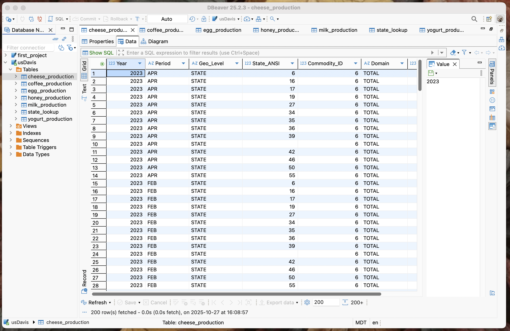
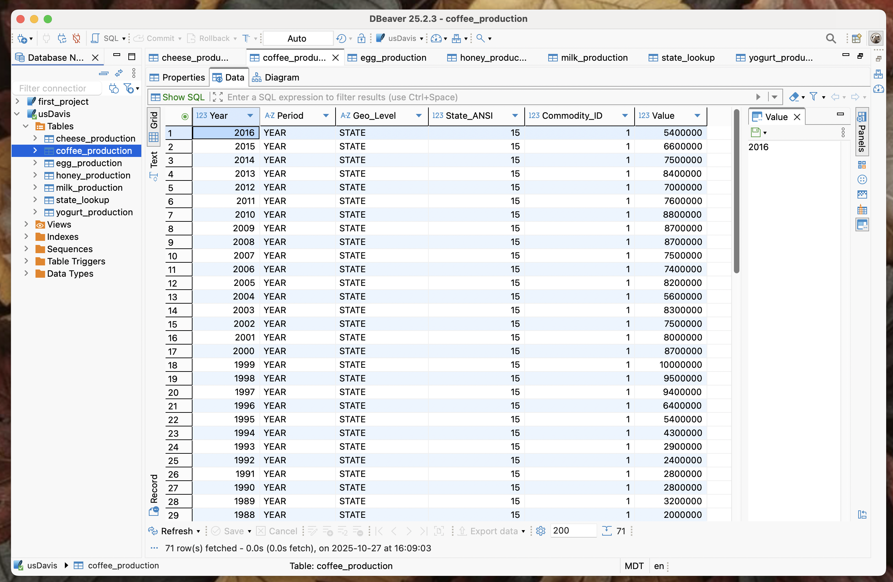
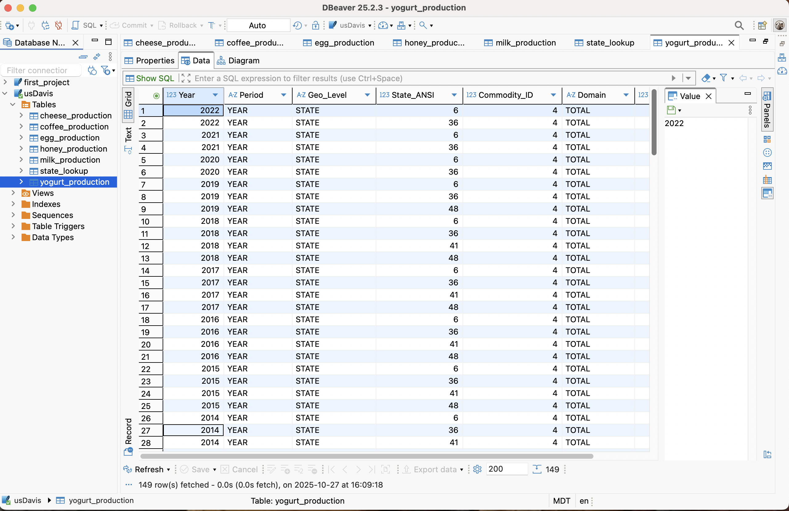
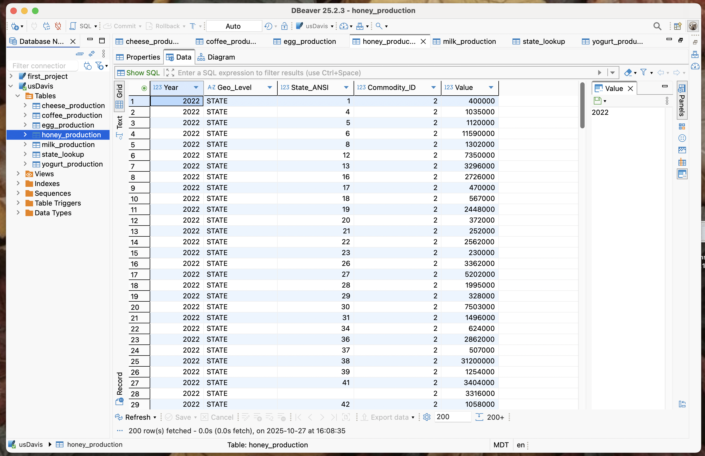
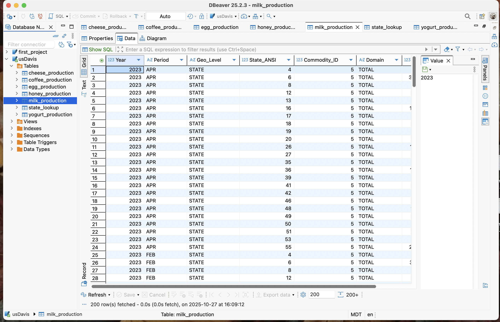
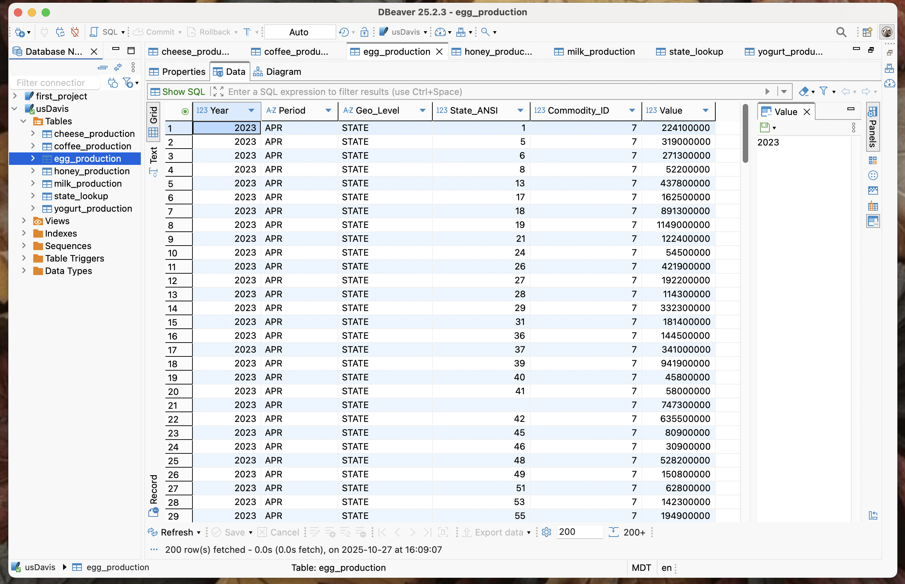
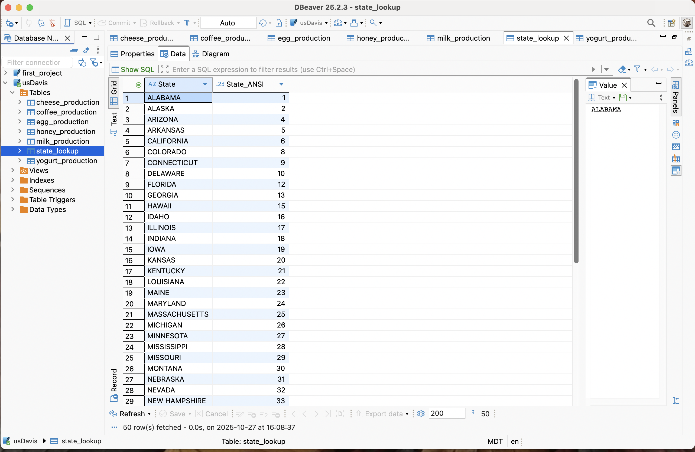
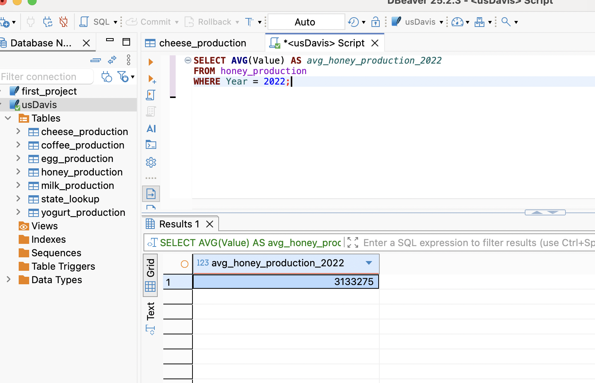
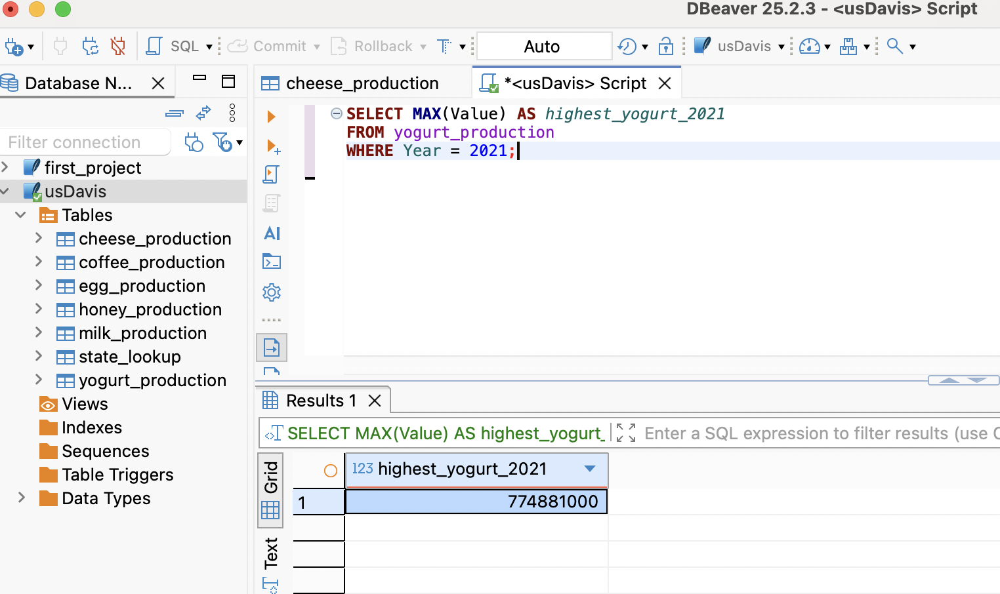
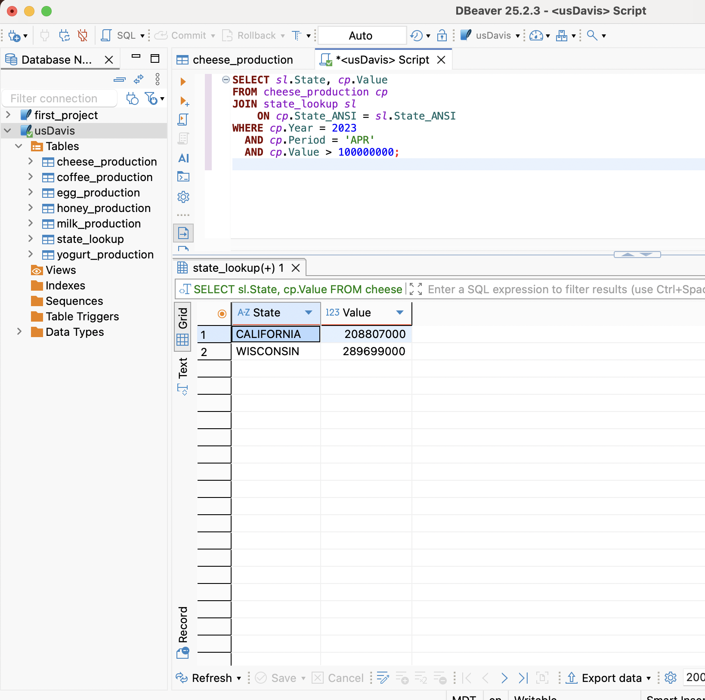

# SQL Data Validation Project – UC Davis (SQLite & DBeaver)

This project was completed as part of the **UC Davis “SQL for Data Science” course** on Coursera.  
It demonstrates SQL skills for data validation and analysis using multiple production datasets.

### Skills Practiced
- Creating and loading tables in SQLite using DBeaver  
- Writing SQL queries with joins, aggregates, filtering, and subqueries  
- Validating relational data across multiple production datasets  

---

## Tables

The project includes **7 relational tables** created from CSV files:

1. `cheese_production`  
2. `coffee_production`  
3. `yogurt_production`  
4. `honey_production`  
5. `milk_production`  
6. `egg_production`  
7. `state_lookup`  

### Table Screenshots

  
  
  
  
  
  
  

---

## SQL Queries

All SQL queries for this project are in [`queries.sql`](queries.sql).  
They include examples of:

- Aggregates: `AVG`, `MAX`  
- Filtering with `WHERE`  
- Subqueries (`IN`)  
- Joins: `LEFT JOIN` and `INNER JOIN`  
- Basic table lookups  

### Query Result Screenshots

**1. Average Honey Production for 2022**  
  

**2. Highest Yogurt Production in 2021**  
  

**3. States with Cheese Production > 100M in April 2023**  
  

---

## Project Structure

sql-data-validation-ucdavis/
│
└── screenshots/
├── cheese_production.png
├── coffee_production.png
├── egg_production.png
├── honey_production.png
├── milk_production.png
├── query_avg_honey_2022.png
├── query_high_yogurt_2021.png
└── query_val_st_apr_2023.png
├── state_lookup.png
├── yogurt_production.png
├── README.md
├── queries.sql

---

**This project demonstrates my ability to work with relational databases, write SQL queries, and validate data across multiple datasets.**

